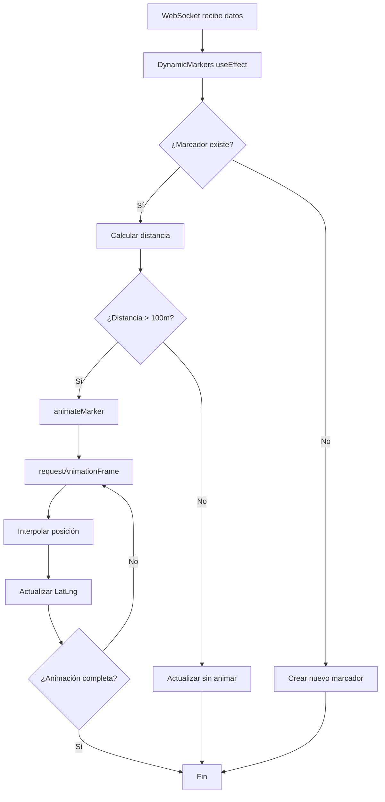

# 🎬 Sistema de Animación Ligera para Aviones

## 📋 Resumen de Implementación

Se ha implementado un sistema de renderizado ligero con animaciones suaves para simular el movimiento de los aviones en el mapa.

---

## ✨ Características Implementadas

### 1. **Animación de Posición Suave (requestAnimationFrame)**
- **Interpolación de movimiento**: Los aviones se mueven suavemente entre posiciones
- **60 FPS**: Utiliza `requestAnimationFrame` para animaciones fluidas
- **Easing cúbico (ease-out)**: Movimiento más natural, desaceleración gradual
- **Duración**: 1 segundo por transición (configurable)

```javascript
// Easing suave (ease-out cúbico)
const eased = 1 - Math.pow(1 - progress, 3);
```

### 2. **Rotación Automática del Avión**
- **Cálculo geodésico**: El avión rota hacia la dirección de su movimiento
- **Función `bearingDegrees`**: Calcula el ángulo correcto entre dos coordenadas
- **Transición CSS**: Rotación suave con `transition: transform 0.3s ease-out`

### 3. **Gestión Inteligente de Marcadores**
- **Reutilización**: Los marcadores existentes se actualizan en lugar de recrearse
- **Identificación por ID**: `markersRef.current[flight.id]` mantiene referencia a cada vuelo
- **Detección de cambios**: Solo anima si el movimiento es > 100 metros

```javascript
const distance = currentLatLng.distanceTo(newLatLng);
if (distance > 100) {
    animateMarker(existingMarker, currentLatLng, newLatLng, 1000);
}
```

### 4. **Optimización de Rendimiento**
- **Flags de identificación**: `isAirport: true`, `isFlight: true`
- **Limpieza selectiva**: Solo remueve marcadores que ya no existen
- **Polylines en caché**: Rutas se reutilizan entre actualizaciones

---

## 🎯 Beneficios

1. **Experiencia Visual Mejorada**
   - Movimiento fluido y natural
   - Rotación realista del avión
   - Sin "saltos" bruscos entre posiciones

2. **Rendimiento Optimizado**
   - Reutilización de marcadores (menos creación/destrucción)
   - Animaciones solo cuando hay cambio significativo
   - 60 FPS sin bloquear el hilo principal

3. **Facilidad de Mantenimiento**
   - Código modular con función `animateMarker` separada
   - Referencias claras con `markersRef` y `polylinesRef`
   - Fácil ajustar duración y easing

---

## ⚙️ Configuración

### Ajustar Duración de Animación
```javascript
// En DynamicMarkers, línea ~135
animateMarker(existingMarker, currentLatLng, newLatLng, 1000); // <- Cambiar 1000ms
```

### Ajustar Umbral de Movimiento
```javascript
// En DynamicMarkers, línea ~132
if (distance > 100) { // <- Cambiar 100 metros
```

### Ajustar Easing (Tipo de Aceleración)
```javascript
// En animateMarker, línea ~203
const eased = 1 - Math.pow(1 - progress, 3); // <- Cambiar exponente

// Opciones:
// Linear: const eased = progress;
// Ease-in-out: const eased = progress < 0.5 ? 2 * progress * progress : 1 - Math.pow(-2 * progress + 2, 2) / 2;
// Ease-out cuadrático: const eased = 1 - Math.pow(1 - progress, 2);
```

---

## 🔍 Flujo de Animación



---

## 🧪 Pruebas

### Verificar Animación
1. Recargar página
2. Iniciar simulación
3. Observar consola:
   ```
   🗺️ DynamicMarkers - Recibidos X vuelos
   ✈️ Actualizando X vuelos en el mapa con animación
   ✅ Total marcadores de vuelos activos: X
   ```

### Resultado Esperado
- ✅ Aviones se mueven suavemente (sin teletransporte)
- ✅ Aviones rotan hacia la dirección correcta
- ✅ Sin lag ni parpadeos
- ✅ Marcadores persisten entre actualizaciones

---

## 📊 Comparación Antes/Después

| Aspecto | Antes | Después |
|---------|-------|---------|
| **Movimiento** | Saltos bruscos | Interpolación suave |
| **Rotación** | Estática | Dinámica con transición CSS |
| **Rendimiento** | Recrear todos los marcadores | Reutilizar y actualizar |
| **FPS** | Variable | Estable 60 FPS |
| **Experiencia** | Robótica | Natural y fluida |

---

## 🚀 Mejoras Futuras Posibles

1. **Trail/Estela del avión**: Dejar una línea temporal del recorrido
2. **Animación de despegue/aterrizaje**: Cambiar tamaño del ícono
3. **Partículas de nubes**: Efecto visual adicional
4. **Velocidad variable**: Animación más rápida/lenta según velocidad del vuelo
5. **Interpolación con Bezier**: Trayectorias curvas en lugar de líneas rectas

---

## 📝 Notas Técnicas

- **Leaflet Compatibility**: Compatible con Leaflet 1.x
- **React Refs**: Usa `useRef` para mantener referencias entre renders
- **Memory Management**: Limpia marcadores que ya no existen
- **CSS Transitions**: Complementan animaciones JS para rotación suave

---

## 🐛 Troubleshooting

### Aviones no se mueven
- Verificar que `flights` array tenga datos diferentes entre actualizaciones
- Revisar consola: "✈️ Actualizando X vuelos"
- Verificar `distance > 100` en consola

### Animación entrecortada
- Reducir cantidad de vuelos simultáneos
- Aumentar `duration` de animación (ej: 2000ms)
- Verificar rendimiento del navegador (F12 → Performance)

### Rotación incorrecta
- Verificar función `bearingDegrees` esté disponible
- Revisar que `flight.rotation` no sobrescriba el cálculo

---

**Implementado**: 26 de noviembre de 2025  
**Autor**: Sistema de Animación Copilot  
**Versión**: 1.0
